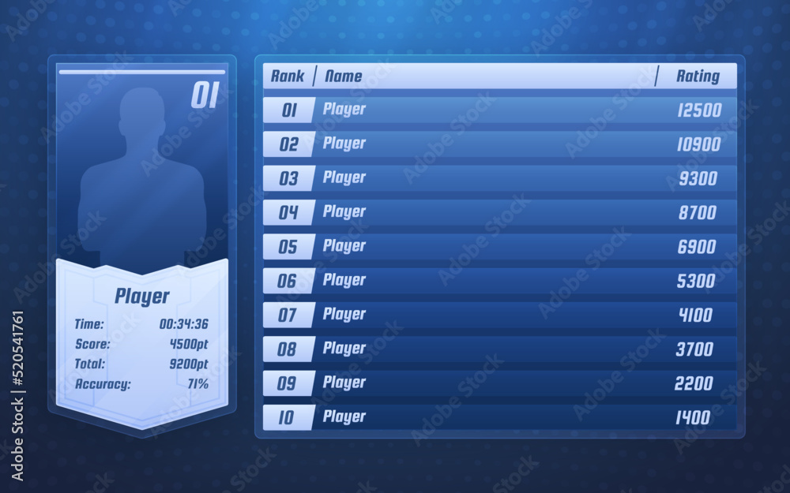

# Game Score Board

<div style="text-align:center;">
    
</div>

## Overview

The "Score Board" project is designed to manage user scores in a game. It provides functionalities for controlling and
tracking user scores independently to game environment.

## Deployment

### Locally

To deploy the project locally, follow these steps:

1. Clone the git repository.
2. Navigate to the project directory.
3. Run the following command:
   ```
   docker-compose up
   ```
   This command will start the necessary services defined in the docker-compose file and start game board on your local
   machine at port `8080`.

### Production

To deploy the project in a production environment, follow these steps:

1. Prepare the `.env` file from the provided `.env-example`.
2. Ensure all environment variables in the `.env` file are correctly configured.
3. Run the project using the following command:
   ```
   java -jar <path_to_jar_file>
   ```
   Replace `<path_to_jar_file>` with the path to the executable JAR file (compiled with `gralde build` command application).

## How to Use

1. Access the project at `localhost:8080`.
2. Follow the Swagger documentation for step-by-step instructions.
    - Create a user
    - Login
    - Set score
    - Get score

## Fake Users
You can manage and access fake users: [fake users](./docs/FakeUsers.md)

&copy; Yehor Chevardin